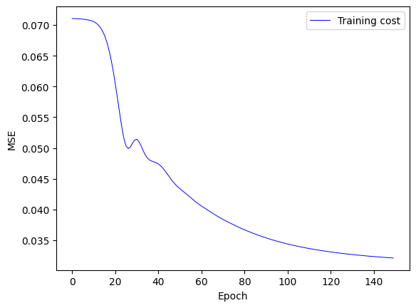

# Recommendation: Matrix Factorization and Deep-Learning

This project demonstrates collaborative filtering on the movie ratings dataset using matrix factorization combined with neural networks.

## Methodology

1. **Dataset Download**
   - Download the dataset from [ratings.dat](https://grouplens.org/datasets/movielens/1m/).

2. **Data Transformation**
   - Convert the data into a matrix format (users and items) and binarize it.

3. **Data Splitting and Model Training**
   - Split the data into training and testing sets.
   - Feed the model, using a sample of negative examples for training.

## Extension

This project is extended with the following enhancements:

- **Loss Functions**
  - Implement different loss functions: sigmoid/BCE loss, BCE loss with logits.
  
- **Deep Learning Framework**
  - Add hidden layers to the implementation using a deep learning framework.

- **Hyperparameter Tuning**
  - Experiment with various hyperparameters and model configurations:
    - Learning rate
    - Number of factors (k)
    - Number of epochs
    - Model parameter initialization
  
- **Negative Sampling**
  - Use different numbers of negative examples for training.

## Evaluation

- **Metric**
  - The models are evaluated using Precision@10.

## Results

The best result was achieved with the following configuration:
- **Training Epochs:** 150
- **Negative Samples:** 10
- **Learning Rate:** 0.01
- **Embedding Size:** 50

This configuration achieved a Precision@10 of 0.22 on the test set, producing the following MSE curve:

